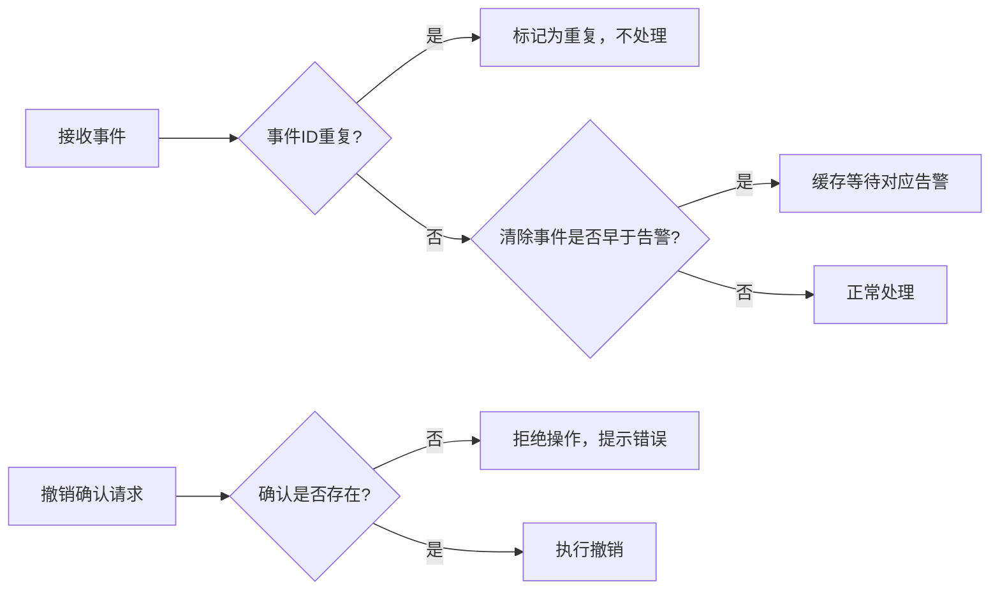

## 1. 产品概述

本地仓库告警回放工具是一个面向运维/安全运营人员的事件回放系统，用于模拟和演练告警事件处理流程，验证告警规则有效性，培训操作员的事件响应能力。工具不依赖地图或遥测平台，可纯本地运行。

- 核心价值：在安全可控的环境中复现历史事件流，验证告警规则，训练应急响应能力
- 目标用户：运维工程师、安全分析师、SOC团队

## 2. 核心功能

### 2.1 Feature Module

1. **主回放面板**：时间轴游标、播放控制、活动告警展示
2. **事件导入模块**：导入JSON格式事件时间轴、乱序样例事件加载
3. **规则配置模块**：告警规则定义、规则版本管理
4. **确认操作模块**：人工确认、撤销确认、确认历史记录
5. **会话管理模块**：自动持久化、重启恢复、状态一致性
6. **导出模块**：导出带处理状态的时间轴

### 2.2 Page Details

| 页面名称 | 模块名称 | 功能描述 |
|---------|---------|---------|
| 主回放面板 | 时间轴控制 | 展示事件时间轴、当前游标位置、播放/暂停/跳转/速度控制 |
| 主回放面板 | 活动告警区 | 实时展示当前活动告警列表、告警级别、持续时间 |
| 主回放面板 | 未解决输入区 | 展示已到达但未处理的原始事件 |
| 主回放面板 | 确认历史区 | 按时间倒序展示确认操作记录、操作员备注 |
| 主回放面板 | 会话状态区 | 显示当前规则版本、游标时间、回放进度 |
| 规则配置页 | 规则列表 | 告警规则CRUD、规则版本切换、规则导入导出 |
| 事件导入页 | 事件预览 | 导入事件预览、乱序检测提示、样例事件一键加载 |
| 导出页面 | 导出选项 | 选择导出范围、格式选择、包含状态选项 |

## 3. 核心流程

### 3.1 主回放流程

用户导入事件时间轴 → 配置/选择告警规则 → 启动回放 → 系统按时间推进生成活动告警 → 操作员查看未解决输入 → 对告警进行人工确认（添加备注） → 可撤销误操作 → 回放完成或中途导出带状态的时间轴。

### 3.2 异常处理流程

当遇到乱序事件时（重复事件ID、清除事件早于告警事件），系统进入容错处理模式：记录异常日志、标记事件状态、不中断回放、保持数据一致性。

## 4. 用户界面设计

### 4.1 设计风格

- **主色调**：工业深蓝 (#0F172A) 作为背景，强调专业感和可靠性
- **告警色系**：严重告警 (#EF4444 红)、重要告警 (#F59E0B 橙)、一般告警 (#3B82F6 蓝)、信息 (#10B981 绿)
- **辅助色**：游标高亮 (#A855F7 紫)、确认操作 (#22C55E 绿)、撤销操作 (#F97316 橙)
- **字体**：显示字体使用 JetBrains Mono（等宽字体，时间戳对齐更专业），正文字体使用 Source Han Sans SC
- **布局风格**：三栏式布局，左侧时间轴控制，中间活动告警，右侧确认历史；使用卡片式分区，清晰的边界线
- **按钮风格**：方角硬朗边框，悬停有发光效果，强调工业控制面板风格
- **图标风格**：使用线性图标，保持简洁专业

### 4.2 页面设计概述

| 页面名称 | 模块名称 | UI元素 |
|---------|---------|---------|
| 主回放面板 | 时间轴控制 | 可拖拽时间轴、时间刻度、游标指示、播放进度条、播放/暂停按钮、快进/后退、速度选择(0.5x/1x/2x/4x)、跳转输入框 |
| 主回放面板 | 活动告警区 | 告警卡片、级别徽章、告警标题、触发时间、持续时间计数器、告警详情展开、确认按钮、备注输入框 |
| 主回放面板 | 未解决输入区 | 事件列表、事件类型标签、原始载荷预览、关联告警链接 |
| 主回放面板 | 确认历史区 | 时间倒序列表、操作员名称、操作类型(确认/撤销)、告警标题、备注内容、操作时间戳 |
| 规则配置页 | 规则列表 | 规则名称、匹配条件、级别、版本号、启用状态、编辑/删除操作 |
| 事件导入页 | 事件预览 | 事件总数、时间范围、乱序警告提示、事件样例列表 |

### 4.3 响应性

- Desktop-first 设计，主面板最小支持 1280px 宽度
- 三栏布局在窄屏下自动切换为上下堆叠
- 时间轴支持鼠标滚轮缩放和拖拽
- 触摸设备支持手势滑动控制游标

## 5. 失败链路覆盖

### 5.1 重复事件编号

- 场景：导入的事件时间轴中存在相同 eventId 的多个事件
- 处理：保留第一个到达的事件，后续重复事件标记为 "duplicate" 状态，不触发告警，不影响游标推进
- 展示：在未解决输入区用灰色标签标记重复事件，悬停显示 "重复事件已忽略"

### 5.2 清除事件早于告警事件

- 场景：clear 事件的时间戳早于对应 alert 事件的时间戳（乱序到达）
- 处理：将 clear 事件放入等待队列，当对应 alert 事件到达后自动匹配清除；若回放结束仍未匹配到对应 alert，标记为 "orphan_clear"
- 展示：等待中的 clear 事件在未解决输入区用橙色标签标记 "等待匹配告警"

### 5.3 撤销不存在的确认

- 场景：用户尝试撤销一个不存在或已被撤销的确认记录
- 处理：拒绝操作，弹出错误提示 "无法撤销：确认记录不存在或已被撤销"
- 恢复：当前回放状态不受影响，可继续正常操作

### 5.4 异常输入保护

- 所有用户输入进行格式校验和长度限制
- JSON 导入使用 try-catch 包裹，解析失败不影响当前会话
- 关键操作前进行状态快照，异常时可回滚
