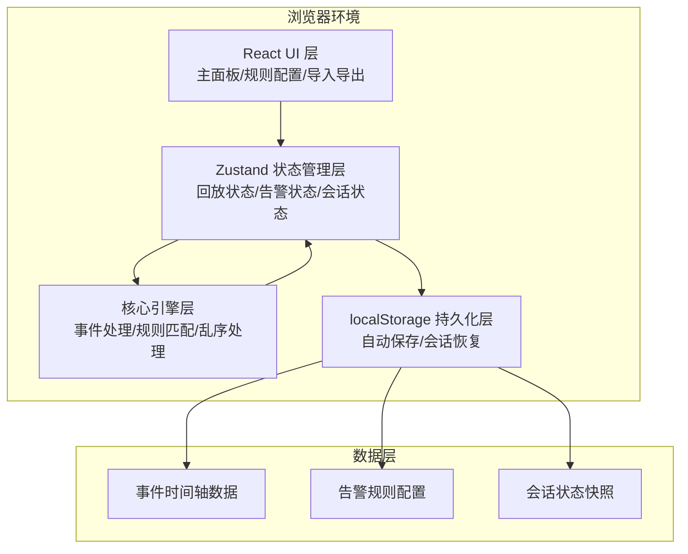
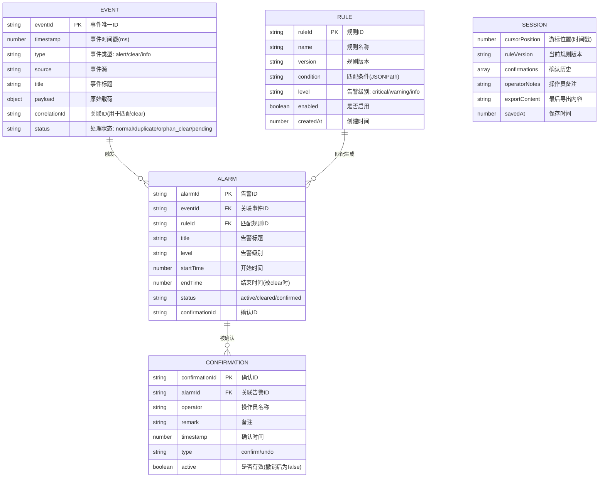

## 1. 架构设计

本工具为纯前端单页应用，无需后端服务，所有数据存储在浏览器 localStorage 中，支持离线运行。



## 2. 技术描述

- **Frontend**: React@18 + TypeScript@5 + Vite@5
- **样式**: TailwindCSS@3 + CSS 变量
- **状态管理**: Zustand@4（轻量级状态管理，支持 devtools 和持久化）
- **图标**: Lucide React（线性图标库）
- **构建工具**: Vite@5
- **数据存储**: localStorage（无需后端）
- **文件格式**: JSON 导入/导出

## 3. 目录结构

```
src/
├── components/          # React 组件
│   ├── Timeline/        # 时间轴组件
│   ├── AlarmPanel/      # 活动告警面板
│   ├── InputQueue/      # 未解决输入区
│   ├── HistoryPanel/    # 确认历史面板
│   ├── RuleEditor/      # 规则编辑器
│   ├── EventImporter/   # 事件导入器
│   └── Controls/        # 播放控制组件
├── store/               # Zustand 状态管理
│   ├── useReplayStore.ts    # 回放主状态
│   └── useSessionStore.ts   # 会话持久化
├── engine/              # 核心引擎
│   ├── types.ts         # 类型定义
│   ├── eventProcessor.ts # 事件处理器
│   ├── ruleEngine.ts    # 告警规则引擎
│   └── outOfOrderHandler.ts # 乱序处理器
├── data/                # 样例数据
│   └── sampleEvents.ts  # 乱序样例事件
├── hooks/               # 自定义 Hooks
│   ├── useReplayControl.ts
│   └── useExport.ts
├── utils/               # 工具函数
│   ├── time.ts          # 时间格式化
│   └── storage.ts       # 存储工具
├── App.tsx              # 主应用组件
├── main.tsx             # 入口文件
└── index.css            # 全局样式
```

## 4. 核心数据模型



## 5. API 定义（内部状态接口）

### 5.1 回放控制接口

```typescript
interface ReplayControl {
  play(speed?: number): void;
  pause(): void;
  jumpTo(timestamp: number): void;
  stepForward(): void;
  stepBackward(): void;
  reset(): void;
  getState(): ReplayState;
}

interface ReplayState {
  isPlaying: boolean;
  speed: number;
  cursor: number;
  startTime: number;
  endTime: number;
  progress: number;
  activeAlarms: Alarm[];
  pendingEvents: Event[];
  processedEvents: Event[];
}
```

### 5.2 确认操作接口

```typescript
interface ConfirmationService {
  confirm(alarmId: string, operator: string, remark: string): Confirmation;
  undoConfirmation(confirmationId: string): boolean;
  getHistory(): Confirmation[];
}
```

### 5.3 会话持久化接口

```typescript
interface SessionManager {
  save(): void;
  restore(): Session | null;
  clear(): void;
  exportTimeline(includeState: boolean): string;
  importEvents(jsonString: string): Event[];
}
```

## 6. 核心算法

### 6.1 乱序事件处理

```typescript
// 伪代码：乱序事件处理流程
function processEvent(event: Event): ProcessResult {
  // 1. 检测重复事件ID
  if (processedEventIds.has(event.eventId)) {
    markAsDuplicate(event);
    return { status: 'duplicate' };
  }
  
  // 2. 检测早到的clear事件
  if (event.type === 'clear') {
    const matchingAlert = findMatchingAlert(event.correlationId);
    if (!matchingAlert) {
      // 放入等待队列
      pendingClearQueue.add(event);
      return { status: 'pending_clear' };
    }
  }
  
  // 3. 检查等待队列中是否有匹配当前alert的clear
  if (event.type === 'alert') {
    const pendingClear = pendingClearQueue.get(event.correlationId);
    if (pendingClear && pendingClear.timestamp <= event.timestamp) {
      // 匹配到早到的clear，直接处理为cleared
      return { status: 'matched_with_early_clear' };
    }
  }
  
  // 4. 正常处理
  return normalProcessing(event);
}
```

### 6.2 告警规则匹配

```typescript
// 伪代码：规则匹配
function matchRules(event: Event, rules: Rule[]): Alarm | null {
  for (const rule of rules) {
    if (!rule.enabled) continue;
    if (evaluateCondition(event.payload, rule.condition)) {
      return createAlarm(event, rule);
    }
  }
  return null;
}
```

### 6.3 时间推进算法

```typescript
// 伪代码：播放时的时间推进
function tick(): void {
  if (!isPlaying) return;
  
  const nextTimestamp = cursor + speed * timeScale;
  
  // 处理游标时间范围内的所有事件
  while (currentEventIndex < events.length) {
    const event = events[currentEventIndex];
    if (event.timestamp <= nextTimestamp) {
      processEvent(event);
      currentEventIndex++;
    } else {
      break;
    }
  }
  
  cursor = nextTimestamp;
  
  // 检查是否到达终点
  if (cursor >= endTime) {
    pause();
  }
  
  // 自动持久化
  autoSave();
}
```

## 7. 持久化策略

### 7.1 localStorage 键定义

| 键名 | 内容 | 保存时机 |
|------|------|---------|
| `replay:session` | 完整会话状态 | 每次状态变更后节流保存(1s) |
| `replay:events` | 导入的事件数据 | 导入成功后 |
| `replay:rules` | 告警规则配置 | 规则变更后 |
| `replay:lastExport` | 最后一次导出内容 | 导出后 |

### 7.2 会话恢复流程

1. 页面加载时检查 `replay:session` 是否存在
2. 若存在，恢复游标位置、规则版本、确认历史、操作员备注
3. 重新计算活动告警状态（基于恢复的游标位置和确认历史）
4. 若 `replay:lastExport` 存在，恢复导出内容
5. 若恢复失败，回退到初始空状态，不抛出异常
